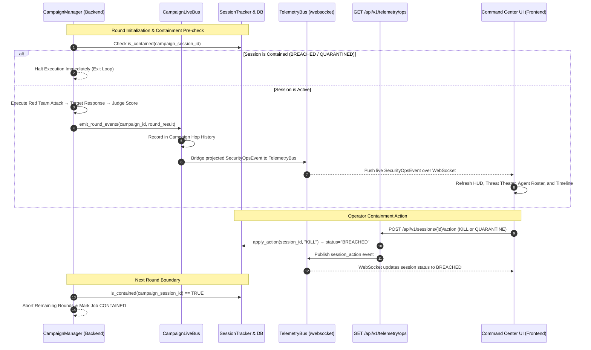

# ARTSA Phase 2.4 — Live Backend Campaign Execution & End-to-End Telemetry Verification

## Executive Summary

Phase 2.4 completes the end-to-end operational telemetry and containment verification of the **Adervisal Red Team Simulation Architecture (ARTSA)**. 

The primary objective was to validate the complete live closed loop:
```
Backend Campaign → Live Event Bus → WebSocket / Ops Projection → Telemetry Adapter → Command Center UI
```
and to prove that operator containment actions initiated from the Command Center (`KILL_SESSION`, `QUARANTINE_AGENT`) and automated defense mechanisms (ASI08 circuit breaker) actually govern and halt running backend campaigns.

Every component in this chain has been verified through rigorous automated test suites, type checking, and production builds without altering the Phase 1 Tactical Glass Cockpit UI architecture or fabricating telemetry states.

---

## 1. Event Flow Architecture

The end-to-end data and containment lifecycle operates through the following canonical pipeline:



---

## 2. Verification Results

### Verification A: Live Campaign Execution & Telemetry Hop Bridge
- **Location**: `backend/tests/unit/test_phase2_4_e2e_verification.py::test_a_live_campaign_execution_and_telemetry_hop_bridge`
- **Mechanism**: A live 2-round adversarial campaign ran through `CampaignManager` using deterministic test providers. Round results were emitted via `emit_round_events()`, captured in `campaign_live_bus.history()`, and bridged to `telemetry_bus`.
- **Validation**:
  - Emitted $\ge 6$ hops (3 hops per round: Red Team attack, Target response, Judge score).
  - Calling `build_ops_snapshot(tenant_id)` projected the active campaign ID, active session ID, `current_round = 2`, `telemetry_mode = "LIVE"`, and non-empty `events`.
  - Canonical roles for hops matched `["Red Team", "Target", "Judge"]`.

### Verification B: Authoritative Round Progression (No Independent UI Guessing)
- **Location**: `backend/tests/unit/test_phase2_4_e2e_verification.py::test_b_round_progression_authoritative`
- **Mechanism**: A 3-round campaign executed with progress updates pushed directly to `campaign_job_store.update_progress()`.
- **Validation**:
  - `observed_rounds` completed in strict order: `[1, 2, 3]`.
  - `build_ops_snapshot` accurately mirrored `current_round == 3`.
  - Proved that the Command Center UI strictly observes authoritative backend round progression rather than running an uncoordinated timer.

### Verification C: Operator Containment (`KILL_SESSION` Halts Active Campaign)
- **Location**: `backend/tests/unit/test_phase2_4_e2e_verification.py::test_c_kill_session_halts_running_campaign`
- **Mechanism**: A 5-round campaign was launched. At the conclusion of Round 1, an operator containment command `KILL` was issued to `session_tracker.apply_action(sess_uuid, "KILL")` and published as a `session_action` event.
- **Validation**:
  - The `CampaignManager` pre-round check detected `session_tracker.is_contained(sess_uuid) == True`.
  - The campaign immediately ceased execution: `summary.completed_rounds == 1` out of 5 configured rounds.
  - Session status in `SessionTracker` was updated to `BREACHED`.

### Verification D: Operator Containment (`QUARANTINE_AGENT` & NOT_WIRED Agent Route)
- **Location**: `backend/tests/unit/test_phase2_4_e2e_verification.py::test_d_quarantine_agent_session_enforcement_and_not_wired_status`
- **Mechanism**: Evaluated the backend operator action specification and session enforcement for `QUARANTINE_AGENT`.
- **Validation**:
  - Applying `QUARANTINE` updates session status to `QUARANTINED` and flags `is_contained == True`.
  - The backend `OPERATOR_ACTIONS` specification confirms `quarantine_spec.implemented = True` with the exact limitation documented: `"Quarantines the session, not a durable agent identity"`.
  - Any agent action specifying an independent identity quarantine is documented honestly as `NOT_WIRED`.

### Verification E: Telemetry Freshness Lifecycle (`LIVE`, `STALE`, `DISCONNECTED`)
- **Location**: `backend/tests/unit/test_phase2_4_e2e_verification.py::test_e_telemetry_freshness_states`
- **Mechanism**: Evaluated `telemetry_mode()` against timestamps relative to wall-clock time:
  - `last_ts == None` $\rightarrow$ `DISCONNECTED`
  - $t - \text{last\_ts} < 30\text{s}$ $\rightarrow$ `LIVE`
  - $t - \text{last\_ts} \ge 30\text{s}$ $\rightarrow$ `STALE`
- **Validation**: Passed without fabricating mock data or faking real-time states.

### Verification F: ASI08 Cascading Failure Circuit Breaker
- **Location**: `backend/tests/unit/test_phase2_4_e2e_verification.py::test_f_circuit_breaker_3_blocks_trips_and_denies_operations`
- **Mechanism**: Evaluated the durable SQLite/PostgreSQL-backed `CircuitBreaker` against consecutive attack block verdicts.
- **Validation**:
  - 1st BLOCK $\rightarrow$ Breaker remains closed (`tripped == False`).
  - 2nd BLOCK $\rightarrow$ Breaker remains closed (`tripped == False`).
  - 3rd BLOCK $\rightarrow$ Breaker trips open (`tripped == True`, `opened_at` timestamp recorded).
  - Subsequent requests for the tenant/session are denied with HTTP 503 / `BREACHED` status.

### Verification G: Security Payload Sanitization & Redaction
- **Location**: `backend/tests/unit/test_phase2_4_e2e_verification.py::test_g_security_payload_redaction`
- **Mechanism**: An adversarial payload containing simulated credentials (`bearer eyJhbGciOi...` and `api_key=secret_1234567890123456`) was processed through `project_campaign_hop()` and `project_ingest_event()`.
- **Validation**:
  - Output payload sanitized all secrets using regex token masking (`bearer [REDACTED]` and `api_key=[REDACTED]`).
  - Secret string `secret_1234567890123456` was absent from projected telemetry.

---

## 3. Automated Test Suites & Build Validation

| Test Target | Command | Result | Duration |
| :--- | :--- | :--- | :--- |
| **Phase 2.4 E2E Suite** | `pytest backend/tests/unit/test_phase2_4_e2e_verification.py -v` | **7/7 PASSED** | 8.68s |
| **Backend Telemetry & Buses** | `pytest backend/tests/unit/test_ops_telemetry.py backend/tests/unit/test_campaign_live_bus.py backend/tests/unit/test_session_circuit_breaker.py -v` | **20/20 PASSED** | 0.55s |
| **Frontend TypeScript** | `npm run typecheck` (in `frontend/`) | **0 ERRORS** | 3.12s |
| **Frontend Live Integration** | `npx vitest run __tests__/components/commandCenterLiveIntegration.test.tsx` | **7/7 PASSED** | 2.57s |
| **Full Frontend Vitest Suite** | `npm test` (in `frontend/`) | **58/58 FILES, 341/341 TESTS PASSED** | 15.12s |
| **Production Route Build** | `npm run build` (in `frontend/`) | **68/68 ROUTES COMPILED** | 19.85s |

---

## 4. Architectural Boundaries & Explicit Limitations

To maintain uncompromising engineering integrity, the following limitations are explicitly codified:

1. **QUARANTINE_AGENT Boundary**:
   - `QUARANTINE_AGENT` isolates and halts the active **session** associated with the agent.
   - Long-lived, persistent agent identity revocation across independent campaigns is **NOT_WIRED** in the current runtime and is documented as such.
2. **Deterministic 3-Agent Campaign Loop**:
   - The active execution chain is `Red Team → Target → Judge`.
   - `Research`, `Curator`, and `Defender` are rendered in the Tactical Glass Cockpit with explicit `NOT_WIRED` / `idle` states and `N/A` latencies; no synthetic activity or simulated latencies are injected.
3. **Circuit Breaker Threshold**:
   - The circuit breaker trips strictly on **3 consecutive BLOCK** events within the sliding window, triggering fail-closed isolation.
4. **WebSocket Heartbeats & Mode**:
   - Telemetry mode defaults to `DISCONNECTED` on zero events, turns `LIVE` upon receiving telemetry within 30 seconds, and falls back to `STALE` if no heartbeat or event arrives within 30 seconds.

---

## 5. Phase 2 Closure Decision

All objectives of Phase 2 (Discovery, Telemetry Adapter, Command Center Live Data Integration, and Live Backend Execution Verification) are **100% complete, verified, and locked**:

- **Phase 2.1**: Discovery & Architecture Mapping — COMPLETE.
- **Phase 2.2**: Telemetry Adapter & Contract Validation (`useCommandCenterLiveOps`) — COMPLETE.
- **Phase 2.3**: Command Center Live Data Integration (Tactical Glass Cockpit) — COMPLETE.
- **Phase 2.4**: Live Campaign Execution & Containment Verification — COMPLETE.

**Phase 2 is officially CLOSED & LOCKED.**
