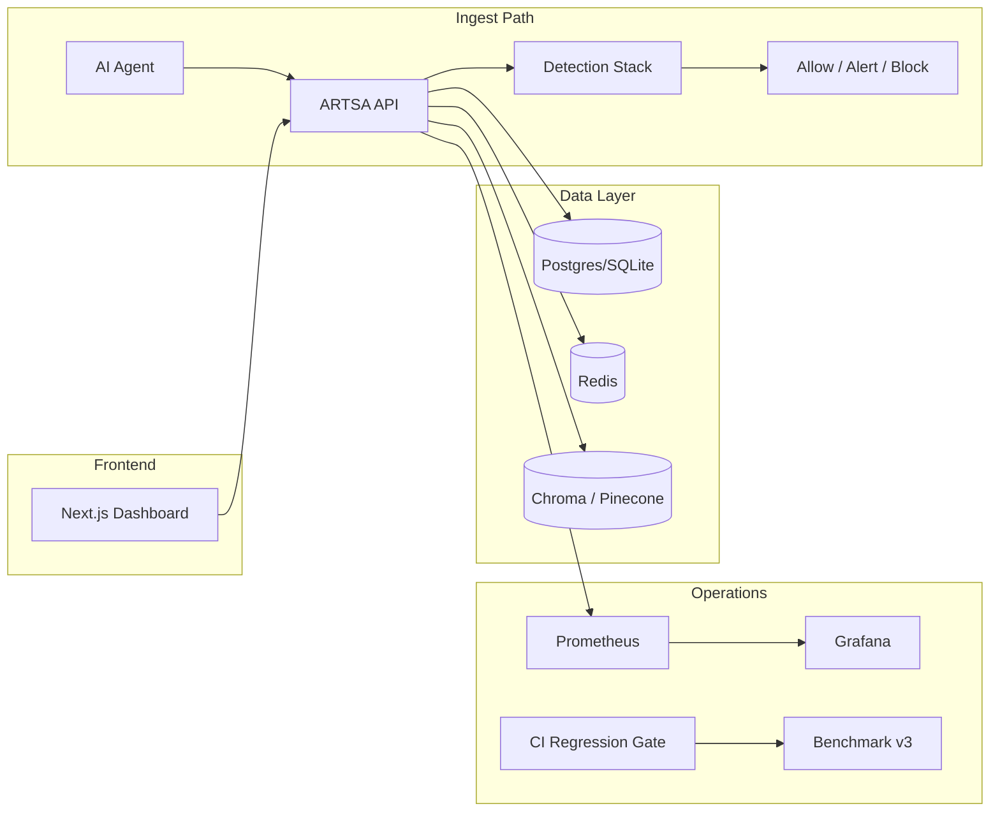

# ARTSA Platform Maturity

This document summarizes production readiness across the ARTSA (Adversarial Red Team Simulation Architecture) stack as of v0.3.0.

## Maturity matrix

| Capability | Status | Notes |
|------------|--------|-------|
| Real-time containment ingest | **Production** | Multi-detector pipeline, &lt;50ms SLO |
| Persistence (SQLite / Postgres) | **Production** | Alembic migrations, evaluation timeline |
| Auth (API keys + OIDC/SSO) | **Production** | PKCE login UI, token refresh, RBAC |
| RBAC (admin/analyst/redteam/readonly) | **Production** | Route-level middleware + UI guards |
| Rate limiting | **Production** | Redis-backed with in-memory fallback |
| RAG policy knowledge | **Production** | Pinecone → Chroma → in-memory cascade |
| Attack library | **Production** | CRUD + semantic search (Chroma/embeddings) |
| Red-team wargame campaigns | **Production** | Celery async jobs, WebSocket live feed |
| Benchmark harness (520-sample v3) | **Production** | CI regression gate with SLO floors |
| Detector ablation | **Production** | Manual + scheduled refresh (hourly in Helm) |
| Observatory dashboard | **Production** | Heatmap, Red Queen, regression gates |
| Observability | **Production** | Prometheus `/metrics/prometheus`, Grafana dashboard |
| Docker Compose | **Production** | API, frontend, Celery, Postgres, Redis, Chroma |
| Kubernetes (Helm) | **Production** | API, frontend, Celery, datastores, ingress, secrets |
| Prometheus scraping | **Production** | Pod annotations + optional ServiceMonitor |
| E2E smoke tests | **Production** | Playwright (4 tests) in CI |
| CI pipeline | **Production** | Backend, frontend, Postgres, ablation, regression gate |

## Architecture overview



## Deployment paths

### Docker Compose (local / demo)

```bash
docker-compose up -d
# Dashboard: http://localhost:3000
# API:       http://localhost:8000
```

### Kubernetes (Helm)

```bash
helm upgrade --install artsa infra/helm/artsa \
  --set secrets.create=true \
  --set secrets.artsaApiKey=$ARTSA_API_KEY \
  --set monitoring.serviceMonitor.enabled=true \
  --set monitoring.serviceMonitor.labels.release=prometheus
```

Enable Prometheus Operator scraping with `monitoring.serviceMonitor.enabled=true`. Pod annotations (`prometheus.io/*`) are enabled by default for legacy Prometheus scrapers.

### CI quality gates

| Gate | Script / Job | Floors |
|------|--------------|--------|
| Unit + integration tests | `pytest tests` | All pass |
| Ablation harness | `test_ablation_harness.py` | Baseline runs |
| Regression gate | `scripts/ci_regression_gate.py` | recall@80 ≥ 0.40, fpr@50 ≤ 0.15, latency ≤ 50ms |

Run locally:

```bash
npm run regression-gate
```

## Key environment variables

| Variable | Purpose |
|----------|---------|
| `ARTSA_API_KEY` | Admin API key |
| `ARTSA_OIDC_*` | SSO / JWT auth |
| `USE_CHROMA_RAG` / `USE_PINECONE_RAG` | RAG backend selection |
| `USE_CELERY` | Async campaign ingest |
| `WARM_BENCHMARK_ON_START` | Pre-warm benchmark + ablation caches |
| `SCHEDULED_ABLATION_INTERVAL_SEC` | Periodic ablation refresh (0=off, 3600=hourly) |
| `SEED_ATTACK_LIBRARY_ON_START` | Chroma seed for attack templates |

See `.env.example` for the full list.

## API highlights (v0.3.0)

| Endpoint | Description |
|----------|-------------|
| `POST /api/v1/ingest` | Real-time containment evaluation |
| `GET /api/v1/observatory` | Live metrics + regression gates |
| `GET /api/v1/attack-library/search?q=` | Semantic attack template search |
| `GET /api/v1/metrics/prometheus` | Prometheus scrape target |
| `POST /api/v1/benchmark/ablation` | On-demand detector ablation |

## Remaining enhancements (optional)

- Multi-tenant org isolation at the DB row level
- HPA autoscaling rules in Helm
- Alertmanager rules bundled with Grafana dashboard
- Attack library mutation engine UI

## Version history

| Phase | Focus |
|-------|-------|
| 1–3 | Persistence, auth, RAG, ablation, Postgres CI |
| 4–6 | Chroma/Pinecone, OIDC SSO, Observatory UI |
| 7–9 | E2E, WS reconnect, Prometheus, Helm chart |
| 10 | Grafana dashboard, CI regression gate, attack library seed |
| 11 | Semantic search API, scheduled ablation, ServiceMonitor |
